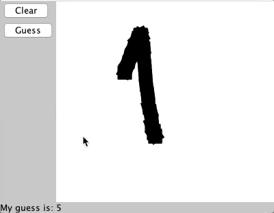

# NN-Digit-Recognition-MnistDS

# Overview
This is the code for the "NN-Digit-Recognition-MnistDS" app written in Java. The app uses custom Neural Network and Matrix library built from scratch. These libraries are not optimised well to do complex math operations. The point of building them myself was to understand inside out how neural networks work.
To recognise digits I used MNIST dataset.
